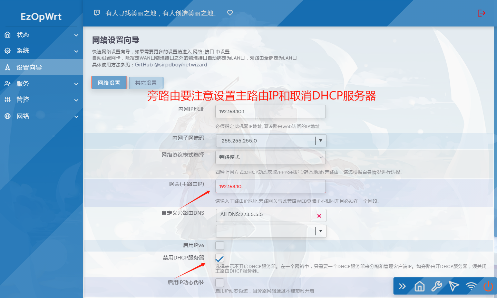
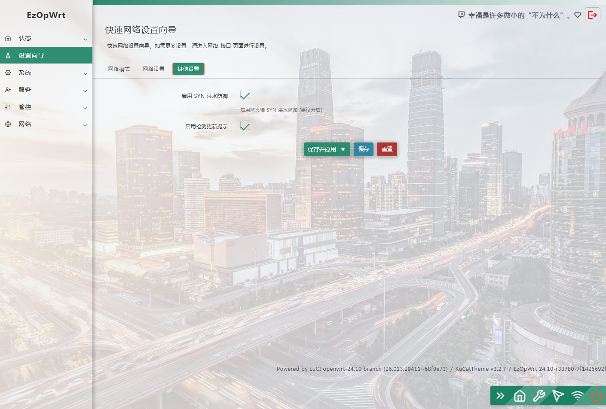
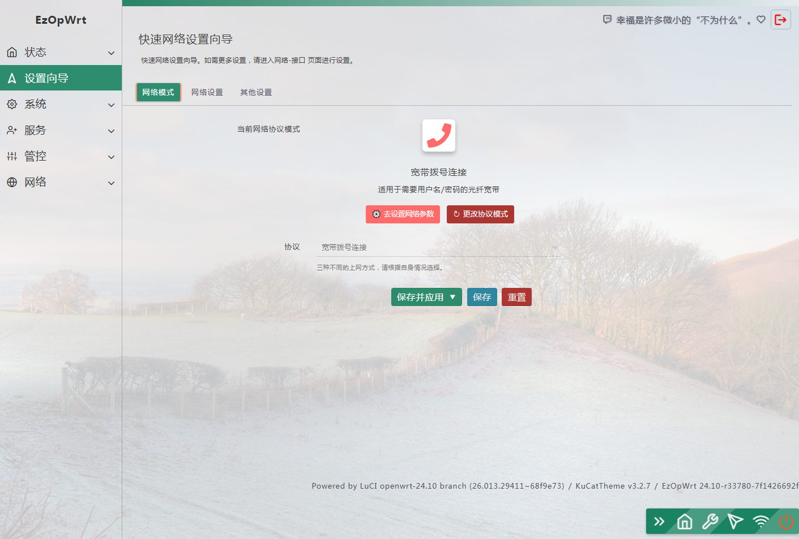

## 访问数：[](https://t.me/joinchat/AAAAAEpRF88NfOK5vBXGBQ)
### 访问数：[] [](https://t.me/joinchat/AAAAAEpRF88NfOK5vBXGBQ)


<p align="center">
<a href="https://openwrt.org"></a>
<a href="https://www.google.com/chrome/"></a>
<a href="https://www.apple.com/safari/"></a>
<a href="https://www.mozilla.org/firefox/"></a>
<a target="_blank" href="https://github.com/sirpdboy/luci-app-wizard/releases"> </a>
<a href="https://github.com/sirpdboy/luci-app-wizard/releases"></a>
</p>


### 源码仓库：  

## git clone  https://github.com/sirpdboy/luci-app-wizard

## 注意：设置向导会清空当前路由的已配置清单,谨慎安装.

## 2026.1.14  设置向导 更新日志：

- 1. 全新开发升级设置向导 v2.1.0 JS  for openwrt25.12
- 2. 修复HTTPS不能自动转向问题。
- 3. 修复单网卡时设置不了的问题。
- 4. 修复接入路由用静态地址报协议错误问题。
- 5. 美化设置界面（借鉴istore设置向导界面和分类）。
- 6. 简化设置参数降低设置难度，（可增加设置LAN口参数）。

## 2025.11.6  设置向导 更新日志：

- 1. 升级设置向导 1.10.1
- 2. 增加自动生成证书，一键设置和取消HTTPS模式。

- 存在的问题：
- 在HTTPS取消时，进入后台需要自己地址栏输入http://192.168.10.1才行。
- 下个版本JS版，将解决这个问题，目前这个是LUA的最终版。后期不再更新。


## 2023.6.25  设置向导 更新日志：

- 1. 升级设置向导 1.8.3
- 2.自动识别WAN口接口
- 3.自动识别LAN口IP
- 4.自动填充旁路由网关前三位。

## 2023.5.5  设置向导 更新日志：

- 1. 升级设置向导 1.7-28
- 2. 增加 自定义防火墙设置
- 3. 增加 SYN-flood 防洪水攻击设置
- 4. 增加 IP动态伪装设置
- 5. 增加 DHCP服务开启和DNS服务通告等实用功能
- 真正实现傻瓜化一键调试上网。

## 2022.7.24  设置向导 更新日志：

- 1. 升级设置向导1.4
- 2. 更新兼容1907以上版本，彻底解决设置端口不兼容问题。
 
## 2022.7.17  设置向导 更新日志：

- 1. 升级设置向导1.3
- 2. 增加物理接口选择，彻底解决设置冲突问题。
- 3. 更新禁用功能，选择后插件设置不生效。


## 2022.7.7  设置向导 更新日志：

- 1. 升级设置向导1.2 
- 2. 增加自动判断设置网卡，路由模式最后一个网卡为WAN口，其它口为LAN口。 旁路由模式将绑定全部网卡为LAN口。
- 3. 修复IPV6 有时候修改不生效问题。
 
 ## 2022.6.10  设置向导 更新日志：

- 1. 升级设置向导1.1 
- 2. 增加旁路由和IPV6功能。
- 3. 在原版的基本上重写代码和界面分布功能。
 
 ### 下载源码方法:

 ```Brach
 
    # 下载源码
	
    git clone https://github.com/sirpdboy/luci-app-wizard package/luci-app-wizard
    make menuconfig
	
 ``` 
### 配置菜单

 ```Brach
    make menuconfig
	# 找到 LuCI -> Applications, 选择 luci-app-wizard, 保存后退出。
 ``` 
 
### 编译

 ```Brach 
    # 编译固件
    make package/luci-app-wizard/compile V=s
 ```
 

## 界面








# My other project

- 路由安全看门狗 ：https://github.com/sirpdboy/luci-app-watchdog
- 网络速度测试 ：https://github.com/sirpdboy/luci-app-netspeedtest
- 计划任务插件（原定时设置） : https://github.com/sirpdboy/luci-app-taskplan
- 关机功能插件 : https://github.com/sirpdboy/luci-app-poweroffdevice
- opentopd主题 : https://github.com/sirpdboy/luci-theme-opentopd
- kucat酷猫主题: https://github.com/sirpdboy/luci-theme-kucat
- kucat酷猫主题设置工具: https://github.com/sirpdboy/luci-app-kucat-config
- NFT版上网时间控制插件: https://github.com/sirpdboy/luci-app-timecontrol
- 家长控制: https://github.com/sirpdboy/luci-theme-parentcontrol
- 定时限速: https://github.com/sirpdboy/luci-app-eqosplus
- 系统高级设置 : https://github.com/sirpdboy/luci-app-advanced
- ddns-go动态域名: https://github.com/sirpdboy/luci-app-ddns-go
- 进阶设置（系统高级设置+主题设置kucat/agron/opentopd）: https://github.com/sirpdboy/luci-app-advancedplus
- 网络设置向导: https://github.com/sirpdboy/luci-app-netwizard
- 一键分区扩容: https://github.com/sirpdboy/luci-app-partexp
- lukcy大吉: https://github.com/sirpdboy/luci-app-lukcy

---------------
 
 
 致谢：
 
x-wrt：https://github.com/x-wrt/com.x-wrt/tree/master/luci-app-wizard

kiddin9：https://github.com/kiddin9/luci-app-wizard

## 使用与授权相关说明
 
- 本人开源的所有源码，任何引用需注明本处出处，如需修改二次发布必告之本人，未经许可不得做于任何商用用途。

## 捐助


|       |    | 
| :-----------------: | :-------------: |
| |  |

<a href="#readme">
    
</a>
